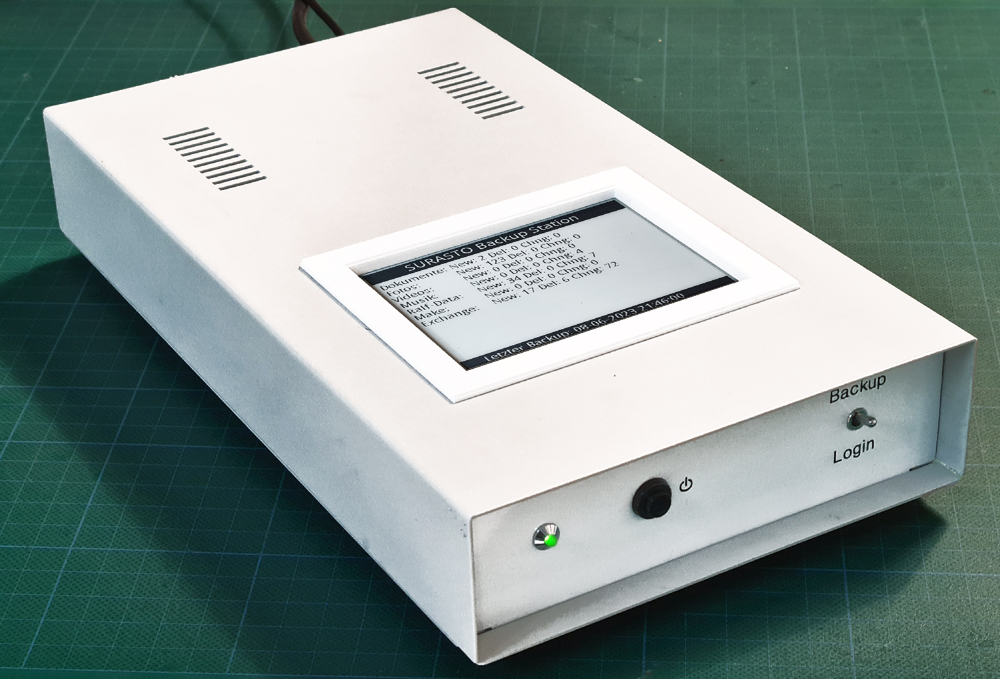
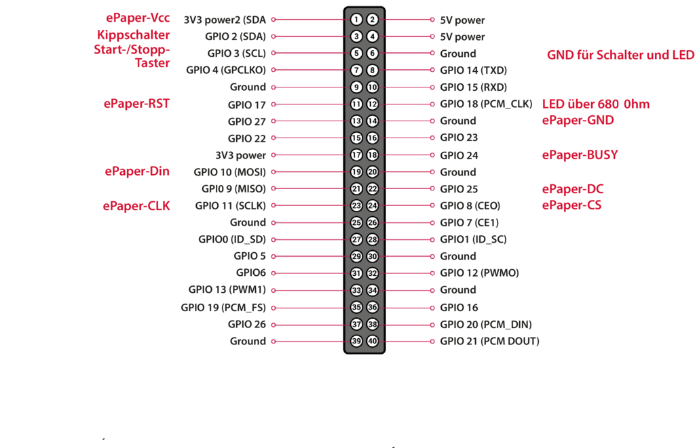

Maker Media GmbH

***

# Backup-Station

**Vorspann aus dem Heft**

Hier gibt es die **[nötigen Skripte](./src/)** und die **[3D-Druck-Dateien](./cad/)**. 

Leider hat sich im Heft ein Druckfehler eingeschlichen: Der Anschluss Din des ePaper-Displays muss an GPIO10 (MOSI) / Pin 19 angeschlossen werden (nicht an GPIO 22 / Pin 15, wie im Heft gezeigt). Hier das korrigierte Bild mit der Pin-Belegung: 
  

Der vollständige Artikel zum Projekt steht in der **[Make-Ausgabe 4/23](https://www.heise.de/select/make/2023/4/2314509325493017392)**.
